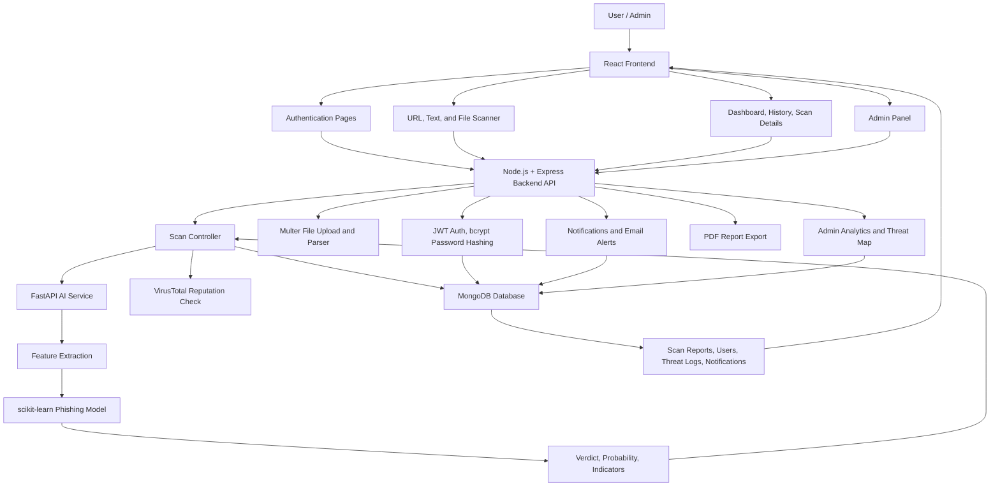

# PhishGuard AI Project Flow and Tech Stack

## Project Flow Chart

## Technology Used and Purpose

| Technology | Used In | Purpose |
| --- | --- | --- |
| React | Frontend | Builds the user interface for login, dashboard, scanner, scan history, admin panel, and scan details. |
| React Router DOM | Frontend | Handles page navigation such as `/dashboard`, `/scanner`, `/history`, and `/admin`. |
| Vite | Frontend | Provides fast development server and production build tooling for the React app. |
| Tailwind CSS | Frontend | Styles the responsive cybersecurity interface, dark mode layouts, cards, buttons, forms, and tables. |
| Lucide React | Frontend | Provides icons for scan actions, navigation, admin tools, alerts, and visual indicators. |
| Recharts | Frontend | Displays dashboard charts and analytics visualizations. |
| Axios | Frontend and Backend | Sends HTTP requests from the frontend to the backend and from the backend to external services. |
| React Hot Toast | Frontend | Shows success and error messages after scans, uploads, login actions, exports, and feedback submissions. |
| Node.js | Backend | Runs the backend API server and project scripts. |
| Express.js | Backend | Creates REST API routes for authentication, scans, admin, chatbot, notifications, and exports. |
| MongoDB | Database | Stores users, scan reports, threat logs, and notifications. |
| Mongoose | Backend | Defines database schemas and queries MongoDB collections. |
| JSON Web Token | Backend | Secures protected routes using token-based authentication. |
| bcryptjs | Backend | Hashes user passwords before saving them to the database. |
| Helmet | Backend | Adds security-related HTTP headers. |
| CORS | Backend | Allows the frontend to communicate with the backend API. |
| express-rate-limit | Backend | Limits repeated API requests to reduce abuse and brute-force attempts. |
| express-validator | Backend | Validates request data for authentication, scans, filters, and feedback. |
| Multer | Backend | Handles uploaded `.txt`, `.eml`, `.csv`, and `.json` scan files. |
| Nodemailer | Backend | Sends email alerts for suspicious or phishing scan results. |
| PDFKit | Backend | Generates downloadable PDF scan reports. |
| Morgan | Backend | Logs HTTP requests during backend operation. |
| dotenv | Backend | Loads environment variables such as database URL, JWT secret, AI service URL, and API keys. |
| FastAPI | AI Service | Exposes AI prediction endpoints for URL and text phishing detection. |
| Uvicorn | AI Service | Runs the FastAPI application server. |
| Pydantic | AI Service | Validates request and response schemas for AI endpoints. |
| scikit-learn | AI Service | Trains and runs the phishing detection machine-learning model. |
| pandas | AI Service | Loads and processes training datasets. |
| NumPy | AI Service | Supports numerical operations used by data processing and machine learning. |
| joblib | AI Service | Saves and loads trained ML model files. |
| VirusTotal API | Optional Reputation Service | Adds external URL reputation signals when an API key is configured. |
| Docker | Deployment | Containerizes frontend, backend, and AI service for consistent deployment. |
| Docker Compose | Deployment | Runs the multi-service stack locally with one command. |
| Vercel | Frontend Deployment | Hosts the production frontend. |
| Render | Backend and AI Deployment | Hosts backend and AI service using included deployment configuration. |
| Vitest | Testing | Runs unit and component tests for frontend and backend code. |
| Testing Library | Frontend Testing | Tests React components from the user’s point of view. |
| Supertest | Backend Testing | Tests Express API endpoints. |
| pytest | AI Testing | Tests Python feature extraction and prediction behavior. |

## Main Data Flow

1. The user logs in or registers through the React frontend.
2. The frontend sends authentication requests to the Express backend.
3. The backend validates data, hashes passwords with bcrypt, and issues JWT tokens.
4. The user submits a URL, text message, or uploaded file for scanning.
5. The backend extracts scan content and sends URL or text data to the FastAPI AI service.
6. The AI service extracts phishing features and returns probability, verdict indicators, and model details.
7. The backend optionally checks VirusTotal reputation data for URL scans.
8. The backend saves the scan report, threat log, and notification data in MongoDB.
9. The frontend displays the verdict, threat score, indicators, explanation panel, and history records.
10. Admin users can view all scans, users, analytics, threat map data, and model feedback counts.

